<!-- perfil de Matheus — v4: mais Matheus, mais animação (tudo self-hosted: carrega sempre) -->
<p align="center">
  
</p>

## 👋 oi, eu sou o Matheus

<p align="center">
  
</p>

Brasiliense, **criador desde sempre** — papel, tela, cor, edição. Um dia vi a IA criando coisas de verdade na minha frente e o clique foi imediato: *eu quero fazer isso também*. Desde 2025 aprendo programando do único jeito que presta — criando.

O que era desenho virou produto: hoje eu projeto a tela, escrevo o servidor, empacoto o APK e subo o deploy. Sem framework, sem dependência, sem colar código que eu não entendo. O que aparece na tela ou responde na API, saiu da minha mão.

```js
const matheus = {
  cidade: 'Brasília — DF',
  criador: ['desenho', 'design', 'identidade visual', 'edição'], // desde antes do código
  comoComecei: 'vi a IA criar e quis criar junto',
  faz: ['sites', 'apps', 'PWA', 'APK Android', 'APIs', 'agentes de IA'],
  stack: ['JavaScript', 'Node.js', 'HTML/CSS na mão', 'Service Worker', 'Puppeteer', 'GitHub Actions'],
  vibe: 'descontraído — coisa séria sem cara de chata',
  principios: ['zero dependência', 'offline-first', 'teste antes de soltar', 'nunca cobrar do aluno'],
  squad: 'Dev Legends',
  desde: 2025
};
```


## 🎨 além do código

<p align="center">
  
</p>

Antes de escrever a primeira linha, eu já criava: desenho, design, identidade, edição. **A cara de tudo o que eu solto é desenhada por mim** — a identidade, os temas, o jeito que o app sente na mão. A IA escreve o código comigo, mas o gosto é meu. Essa é a minha parte favorita: fazer a tela ter personalidade.

## ✦ como eu codo

- **Vibecoder e assumo**: comecei vendo a IA criar — hoje ela é minha parceria de teclado. Ela acelera, eu decido. A visão do produto, o padrão de qualidade e a palavra final são sempre meus.
- **Tudo automático depois de mim**: deploy no push, bateria de testes rodando sozinha, backup cifrado todo dia. Máquina cuida do repetitivo, eu cuido do que importa.
- **Simplicidade é engenharia**: Node puro, zero dependência, um servidor de arquivo único aguentando produção de verdade. Menos peça = menos coisa quebrando.
- **Feito no Brasil, pra quem estuda no Brasil**: interface em português, funciona no celular fraco, com internet ruim e sem cobrar nada.

## 🛠️ o que eu uso

<p align="center">
  
  
  
  
  
  
</p>


## 📍 a jornada

<p align="center">
  
</p>

## 🚀 construindo agora

**estuda+** — app de estudos com IA que eu construí inteiro, do servidor ao APK: **[abrir o app](https://estuda-mais-2fw8.onrender.com)**

<p align="center">
  
</p>
<p align="center">
  
  
</p>

## 🤖 meu par de IA

<p align="center">
  
</p>

Esse é o combinado do meu jeito de codar: **eu decido a direção, o agente escreve o código, a assinatura é minha.** Ele não é autor — é par. E aceitou o posto de colaborador oficial deste perfil. 💜

## ✦ o sonho

<p align="center">
  
</p>

- ✦ **estuda+ na Play Store** — meu app na loja oficial, chegando em todo mundo
- ✦ **viver criando tecnologia** — transformar o que é diversão em profissão
- ✦ soltar mais apps próprios, um por ideia boa
- ✦ segurar o padrão: **zero dependência, teste antes de soltar**

## 🤝 Dev Legends

Membro do **[Dev Legends](https://github.com/Devlegendsprime)** — squad de 3 devs breaking code & building legends desde 2025. 💙

---

<p align="center">
  
</p>
<p align="center"><sub>✦ matheus@estuda-mais.app · sempre criando ✦</sub></p>
