<!-- perfil de Matheus — dev que faz sites e apps (v2: céu de Brasília animado, mais eu e menos app) -->
<p align="center">
  
</p>

<p align="center">
  
</p>

## 👨‍💻 quem é

Sou o **Matheus**, brasiliense do Plano Piloto 🔷 — **dev full-stack de verdade**: projeto a tela, escrevo o servidor, monto o banco, empacoto o APK e subo o deploy. Não uso framework, não carrego dependência, não colo código que eu não entendo. O que aparece na tela ou responde na API, saiu da minha mão.

Gosto de coisa **pequena, rápida e viva**: um app de 110 KB que se atualiza sozinho me dá mais orgulho que um monstro de 100 MB. Quando termino algo, a última coisa que faço antes de soltar é botar **máquina pra testar** — porque software sem teste é promessa, e eu entrego produto.

```js
const matheus = {
  cidade: 'Brasília — DF',
  faz: ['sites', 'apps', 'PWA', 'APK Android', 'APIs', 'agentes de IA'],
  stack: ['JavaScript', 'Node.js', 'HTML/CSS na mão', 'Service Worker', 'Puppeteer', 'GitHub Actions'],
  vibe: 'vibecoder — codo com IA ao lado, mas o gosto e a responsabilidade são meus',
  principios: ['zero dependência', 'offline-first', 'teste antes de soltar', 'nunca cobrar do aluno'],
  squad: 'Dev Legends',
  desde: 2025
};
```


## ✦ como eu codo

- **Vibecoder e assumo**: a IA é minha parceria de teclado — ela acelera, eu decido. A visão do produto, o padrão de qualidade e a palavra final são sempre minhas.
- **Tudo automático depois de mim**: deploy só de dar push, bateria de testes roda sozinha, backup cifrado todo dia. Máquina cuida do repetitivo, eu cuido do que importa.
- **Simplicidade é engenharia**: Node puro, zero dependência, um servidor de arquivo único que aguenta produção de verdade. Menos peça = menos coisa quebrando.
- **Feito no Brasil, pra quem estuda no Brasil**: interface em português, funciona no celular fraco, com internet ruim e sem cobrar nada.

## 🛠️ o que eu uso

<p align="center">
  
  
  
  
  
  
</p>


## 📍 a jornada

<p align="center">
  
</p>

## 🚀 construindo agora

**estuda+** — app de estudos com IA que eu construí inteiro, do servidor ao APK: **[abrir o app](https://estuda-mais-2fw8.onrender.com)**

<p align="center">
  
</p>
<p align="center">
  
  
</p>

## 🤖 meu par de IA

<p align="center">
  
</p>

Esse é o combinado do meu jeito de codar: **eu decido a direção, o agente escreve o código, a assinatura é minha.** Ele não é autor — é par. E aceitou o posto de colaborador oficial deste perfil. 💜

## 🎯 no radar

- ✦ botar o **estuda+** na Play Store
- ✦ soltar mais apps próprios, um por ideia boa
- ✦ aprofundar em agentes de IA e automação
- ✦ segurar o padrão: **zero dependência, teste antes de soltar**

## 🤝 Dev Legends

Membro do **[Dev Legends](https://github.com/Devlegendsprime)** — squad de 3 devs breaking code & building legends desde 2025. 💙

---

<p align="center">
  
</p>
<p align="center"><sub>✦ matheus@estuda-mais.app · sempre codando ✦</sub></p>
